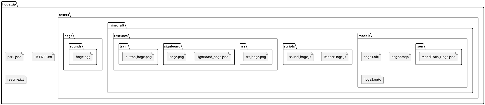

# RealTrainMod モデルパック作成マニュアル -RTM2.4.8対応版
著：ngt5479

1.はじめに
RTM モデルパック作成キットをダウンロードいただきありがとうございます。RealTrainMod
（略称：RTM）では乗り物やレール、看板など、色々な車両や設置物をモデルパックというアド
オン形式で追加することができます。このマニュアルでは、モデルパックの作成する際の構成や
必要なファイルについて解説します。
注意事項
・まず同封されている LICENCE.txt をご覧下さい
・他人の著作物を無断使用することは絶対にお止めください
・全て個人で作成した場合は、ご自由に配布していただいて構いません
・分からない点がございましたら、遠慮無くお尋ねください
内容物
・RTM モデルパック作成マニュアル_x.x.x_x.pdf：当ファイル
・src1.12.2(201x.xx.xx)_forge-1.12.2-xx.xx.x.xxxx.zip：ソースコード
・LICENCE.txt：ライセンス
Web ページ
・Curse Forge
連絡先

2.モデルパックの構成
(1)ファイル配置の例
モデルパックは ZIP ファイルとして作成します。ZIP 直下に以下のような構成でフォルダやファ
イルを配置してください。注意書きのないフォルダ、ファイルについては自由に名前を付けてく
ださい。ただし、モデルや音声ファイル等については他のモデルパックと被らないような名前が
良いです。

```
.
└── Edit me to generate/
    ├── a/
    │   └── nice/
    │       └── tree/
    │           ├── diagram!
    │           └── :)
    └── Use indentation/
        ├── to indicate/
        │   ├── file
        │   ├── and
        │   ├── folder
        │   └── nesting.
        └── You can even/
            └── use/
                ├── markdown
                └── bullets!
```


graph TD;
    A[project] --> B[src]
    A --> C[assets]
    A --> D[README.md]
    B --> E[main.js]
    B --> F[utils.js]
    C --> G[logo.png]
    C --> H[style.css]
