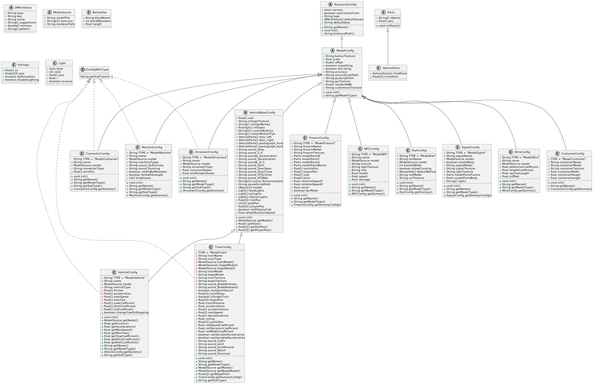

このページは、RealTrainMod (RTM)のアドオン制作で使用するJSONの設定項目のリファレンスです。

## JSON設定項目の構造
完全なJSONの設定項目の内容は、`jp.ngt.rtm.modelpack.cfg`パッケージの各クラスを確認することによって知ることができます。
### `jp.ngt.rtm.modelpack.cfg`パッケージのクラス図
パッケージ内の各クラスのメンバとクラス同士の関係性は、以下の図のようになっています。

この図を見てわかる通り、抽象クラス`ResourceConfig`が全ての継承元となっており、その継承先に実際の各モデルのコンフィグクラスが実装されています。
## モデルタイプとコンフィグクラスの対応
実装する各モデルに対応するコンフィグクラスは以下の通りです。
| モデルタイプ       | 接頭辞            | サブタイプ      | 対応クラス      |
| ------------------ | ----------------- | --------------- | --------------- |
| 火器               | `ModelFirearm_`   | -               | FirearmConfig   |
| レール             | `ModelRail_`      | -               | RailConfig      |
| 信号機             | `ModelSignal_`    | -               | SignalConfig    |
| コンテナ           | `ModelContainer_` | -               | ConnectorConfig |
| NPC                | `ModelNPC_`       | -               | NPCConfig       |
| ワイヤー           | `ModelWire_`      | -               | WireConfig      |
| 看板               | `SignBoard_`      | -               | -               |
| 標識               | `RRS_`            | -               | -               |
| コネクター（中継） | `ModelConnector_` | Relay           | ConnectorConfig |
| コネクター（入力） | `ModelConnector_` | Input           | ConnectorConfig |
| コネクター（出力） | `ModelConnector_` | Output          | ConnectorConfig |
| 遮断機             | `ModelMachine_`   | Gate            | MachineConfig   |
| ポイント           | `ModelMachine_`   | Point           | MachineConfig   |
| 改札機             | `ModelMachine_`   | Turnstile       | MachineConfig   |
| 券売機             | `ModelMachine_`   | Vendor          | MachineConfig   |
| 照明（RS入力可）   | `ModelMachine_`   | Light           | MachineConfig   |
| 車止め             | `ModelMachine_`   | BumpingPost     | MachineConfig   |
| ATC                | `ModelMachine_`   | Antenna_Send    | MachineConfig   |
| 列車検出器         | `ModelMachine_`   | Antenna_Receive | MachineConfig   |
| 照明               | `ModelOrnament_`  | Lamp            | OrnamentConfig  |
| 階段               | `ModelOrnament_`  | Stair           | OrnamentConfig  |
| 足場               | `ModelOrnament_`  | Scaffold        | OrnamentConfig  |
| 架線柱             | `ModelOrnament_`  | Pole            | OrnamentConfig  |
| パイプ             | `ModelOrnament_`  | Pipe            | OrnamentConfig  |
| 植物               | `ModelOrnament_`  | Plant           | OrnamentConfig  |
| 電車               | `ModelTrain_`     | EC              | TrainConfig     |
| 気動車             | `ModelTrain_`     | DC              | TrainConfig     |
| 貨物車             | `ModelTrain_`     | CC              | TrainConfig     |
| タンク車           | `ModelTrain_`     | TC              | TrainConfig     |
| 試験用車両         | `ModelTrain_`     | Test            | TrainConfig     |
| 自動車             | `ModelVehicle_`   | Car             | VehicleConfig   |
| 飛行機             | `ModelVehicle_`   | Plane           | VehicleConfig   |
| 船                 | `ModelVehicle_`   | Ship            | VehicleConfig   |
## 各コンフィグクラスのリファレンス
- [ResourceConfigクラス](../resource-config)